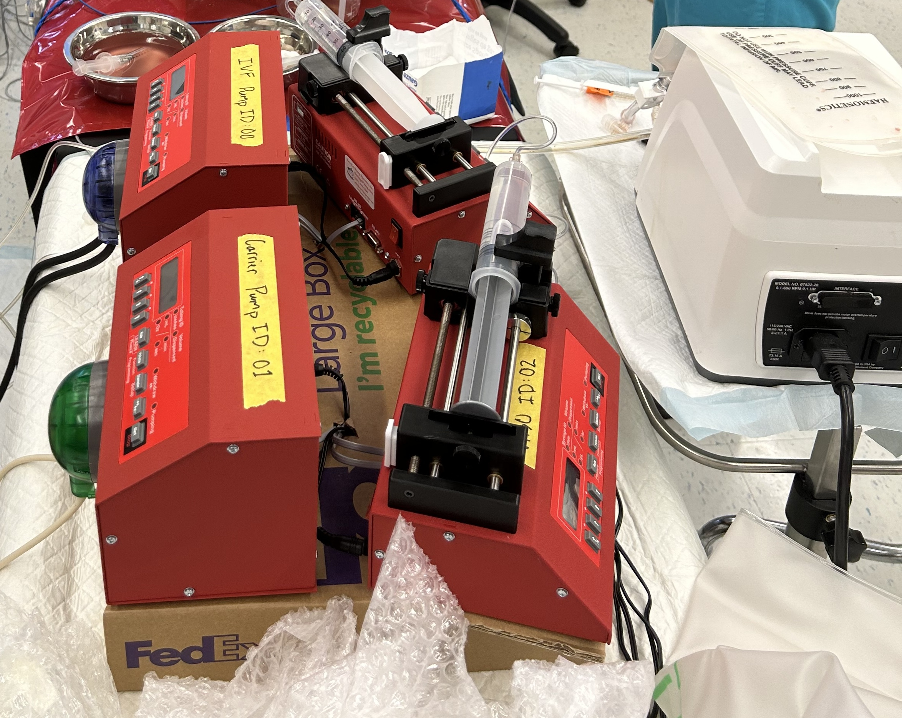
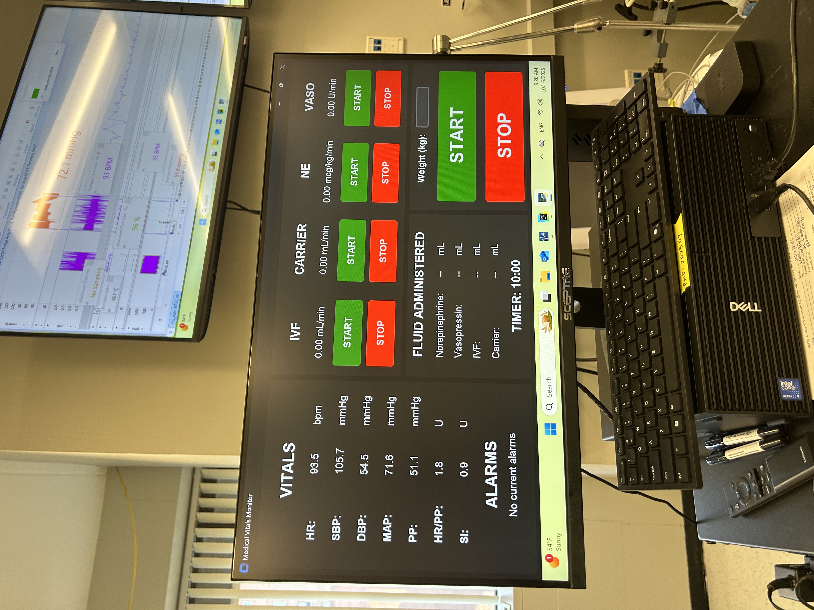

When organs fail, technology becomes a bridge between injury and recovery. At ASPIRE, we engineer, evaluate, and optimize advanced organ support technologies with a singular goal: to restore physiologic function while minimizing unintended harm.

Our approach integrates systems physiology, translational experimentation, and quantitative analysis to rigorously define how devices interact with the body — and how those interactions can be improved.

<figure>
  
  <figcaption>Automated titration pumps</figcaption>
</figure>

<figure>
  
  <figcaption>Monitoring for automated resuscitation system</figcaption>
</figure>

### The Device–Organ Interface
Organ support technologies do not function in isolation. They alter pressure, flow, gas exchange, inflammation, and metabolic balance. Understanding this dynamic interface is essential for improving performance and safety.

We investigate:
- Hemodynamic and respiratory interactions during mechanical support
- Mechanical unloading and its physiologic consequences
- Gas exchange optimization in extracorporeal systems
- Device-induced inflammatory and vascular responses
- Multi-organ effects of advanced support strategies

Our work includes technologies such as Extracorporeal membrane oxygenation and Extracorporeal carbon dioxide removal, as well as emerging device-based and regenerative platforms.

### Translational Evaluation and Optimization
A defining feature of ASPIRE is the ability to evaluate organ support systems within controlled, physiologically rich experimental environments.

Using high-resolution monitoring and integrative modeling, we:
- Quantify device performance under clinically relevant conditions
- Identify physiologic targets for optimization
- Evaluate trade-offs between support intensity and tissue injury
- Test novel control strategies and support paradigms

This translational framework enables us to move beyond empirical adjustments toward mechanistically informed optimization.

### Toward Intelligent and Adaptive Support
The future of organ support lies in systems that respond dynamically to patient state. We are developing approaches that integrate engineering design with real-time physiologic data and computational modeling to create more responsive and adaptive support strategies.

Our goals include:
- State-guided titration of support intensity
- Integration of predictive modeling into device control
- Personalized optimization based on physiologic phenotype
- Development of next-generation regenerative and hybrid support systems

By embedding physiologic insight into engineering design, we aim to advance technologies that are not only more effective, but safer and more patient-centered.

### From Innovation to Impact
Engineering innovation must translate to clinical benefit. Through interdisciplinary collaboration with clinicians, engineers, and industry partners, we work to accelerate the development of advanced organ support systems from concept to clinical application.

By combining mechanistic understanding with engineering rigor, ASPIRE seeks to redefine how technology supports organ recovery and improves patient outcomes.
